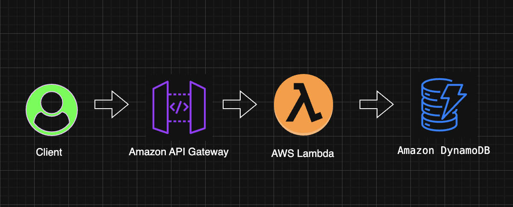
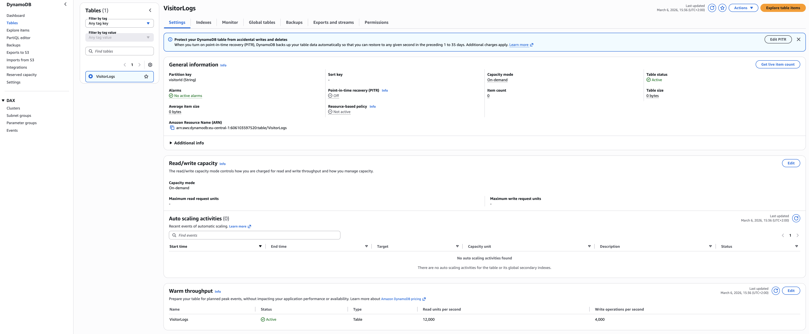
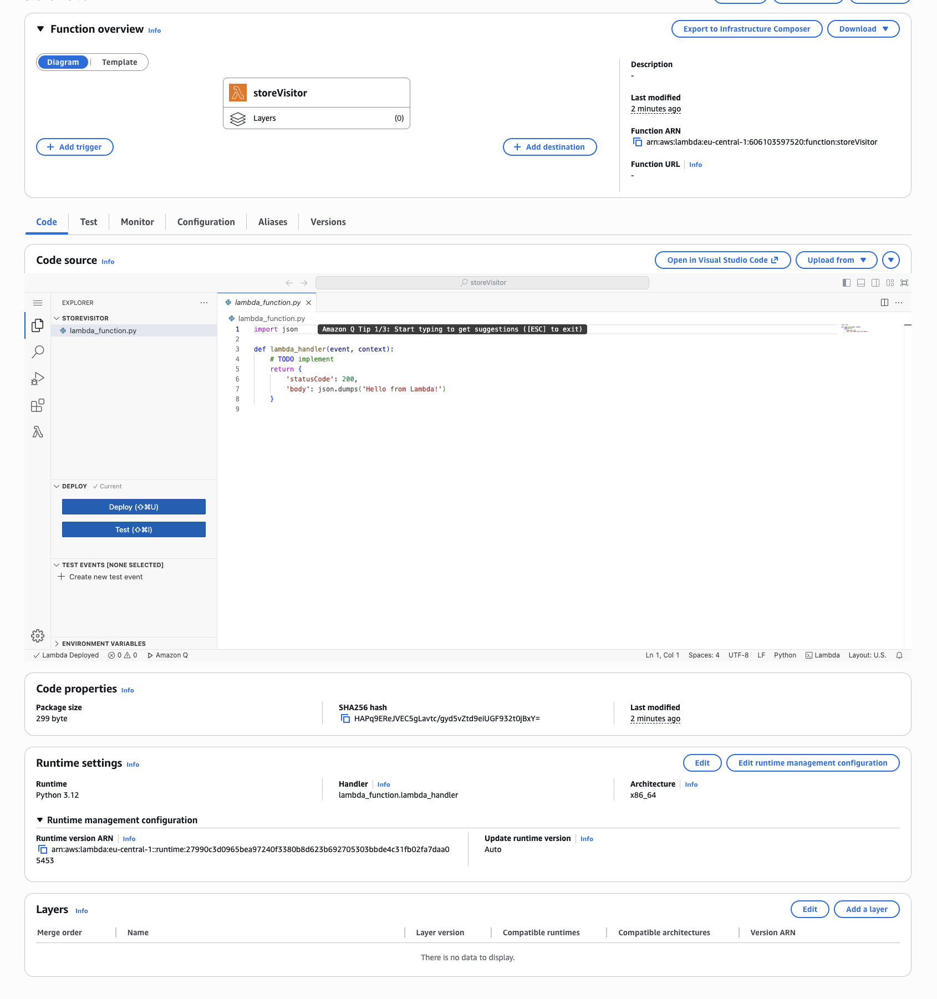
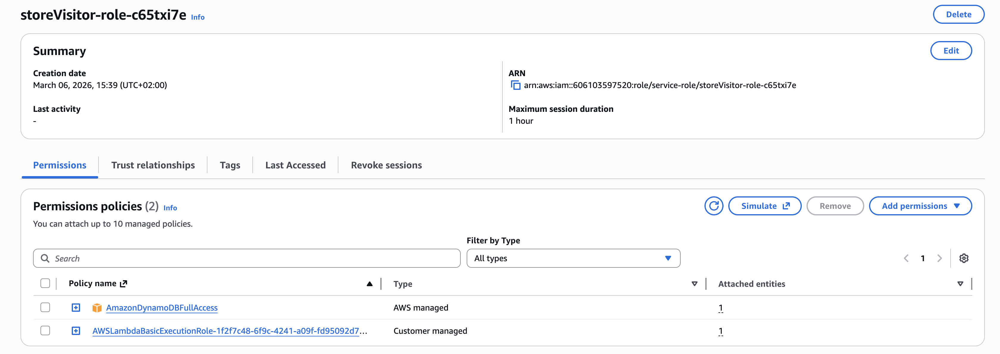
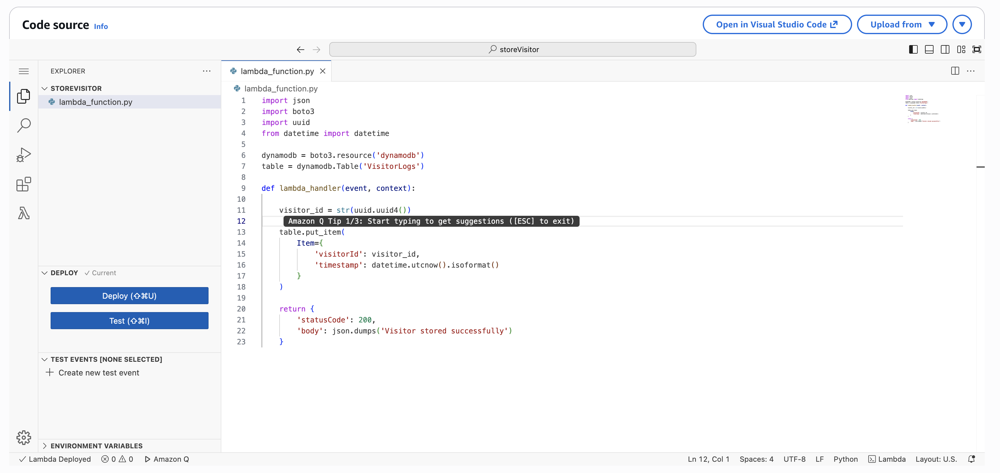
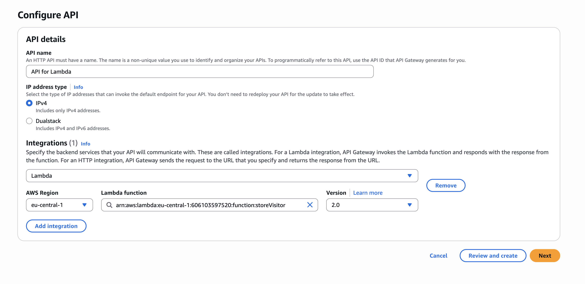
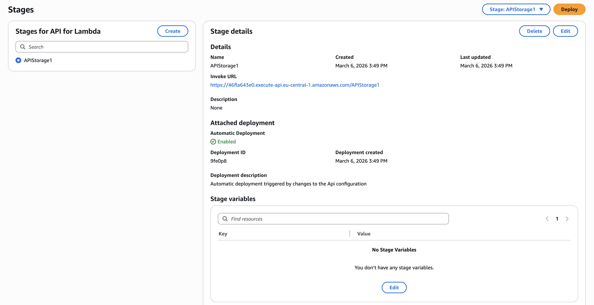
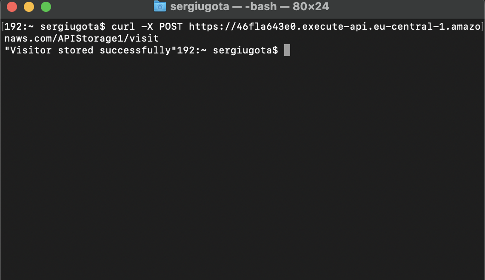
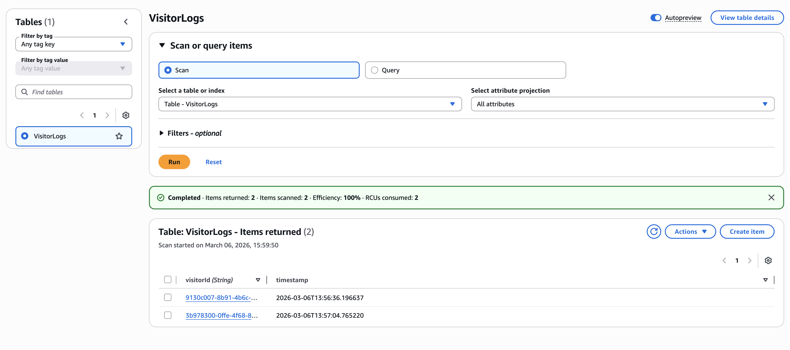

# Serverless Visitor API (API Gateway → Lambda → DynamoDB)

This project demonstrates a serverless backend architecture on AWS using API Gateway, AWS Lambda, and DynamoDB.

When a client sends a request to the API, AWS Lambda processes the request and stores a record in DynamoDB.

---

# Architecture

Flow:

Client → API Gateway → Lambda → DynamoDB

---

## Real World Use Case

This architecture is commonly used in serverless applications such as:

- Website visitor tracking
- Event logging systems
- Lightweight backend APIs
- Serverless microservices

Because the system is fully serverless, AWS automatically handles scaling, availability, and infrastructure management.

# Services Used

- Amazon API Gateway
- AWS Lambda
- Amazon DynamoDB
- AWS IAM

---

# How the System Works

1. Client sends a **POST request** to the API endpoint:

`POST /visit`

2. API Gateway receives the request.

3. API Gateway triggers the Lambda function.

4. The Lambda function:
- generates a unique visitor ID
- records a timestamp
- stores the record in DynamoDB

5. The API responds with:

`Visitor stored successfully`

---

# Lambda Code

See: `lambda/lambda_function.py`

---

## Project Structure

aws-api-lambda-dynamodb
│
├── README.md
├── architecture-diagram.png
│
├── lambda
│   └── lambda_function.py
│
└── screenshots
    ├── 1-dynamodb-table.png
    ├── 2-lambda-function.png
    ├── 3-iam-role.png
    ├── 4-lambda-code.png
    ├── 5-api-route.png
    ├── 6-api-stage.png
    ├── 7-api-test.png
    └── 8-dynamodb-items.png

# Screenshots

## 1. DynamoDB Table

## 2. Lambda Function

## 3. IAM Role Permissions

## 4. Lambda Code

## 5. API Gateway Route

## 6. API Gateway Stage

## 7. API Test

## 8. DynamoDB Records

---

# Learning Outcomes

This project demonstrates:

- Serverless architecture design
- API Gateway integration with Lambda
- Writing data to DynamoDB
- IAM permissions for Lambda
- Building event-driven APIs
